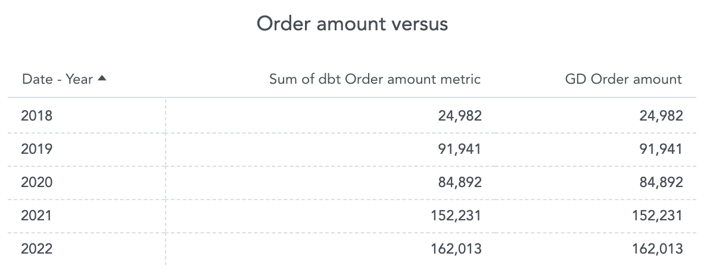
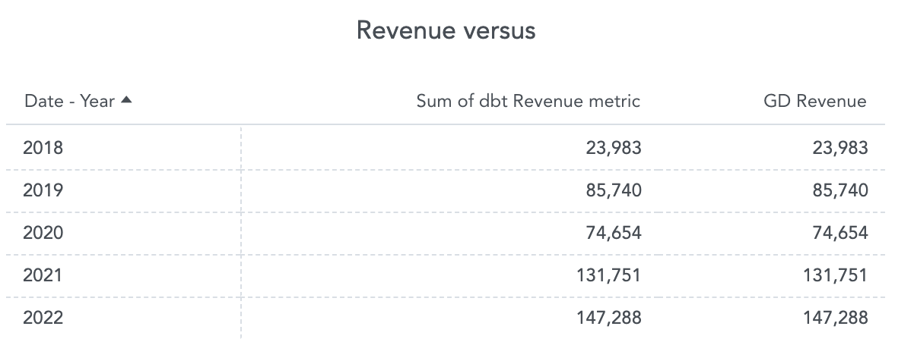
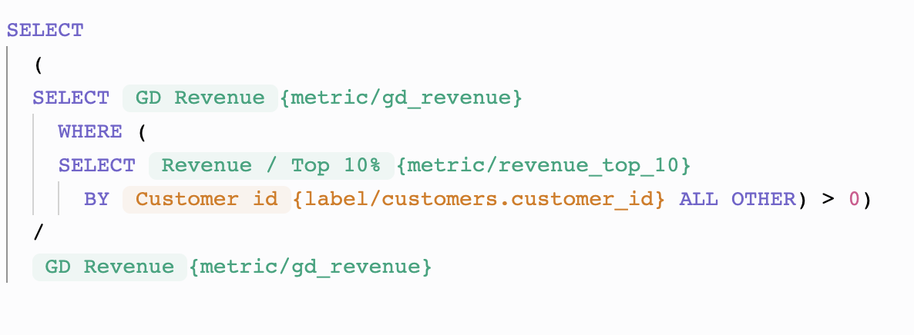
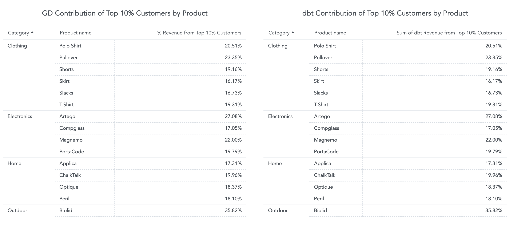
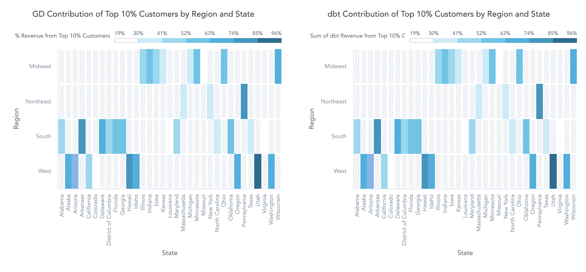

# GoodData vs. dbt Metrics

In this document I would like to compare GoodData and dbt metrics. I created two dashboards for that purpose.
* [The same feature set](http://localhost:3000/dashboards/#/workspace/gd_vs_dbt_metrics/dashboard/dbf9314c-927f-49f9-9122-6c1a8c7c6b9c) 
* [Where dbt Metrics does not work well](http://localhost:3000/dashboards/#/workspace/gd_vs_dbt_metrics/dashboard/e6306a8c-3d6d-4dfc-8f9d-79cdcd6ccdee)

Let us break these comparisons down.

## What is a metric?

### GoodData metric definition

GoodData metric is defined as
> a computational expression of numerical data

and also

> count of individual values of the attribute

### dbt Metric definition

dbt Metric is according to [documentation](https://docs.getdbt.com/docs/build/metrics) defined as
> a timeseries aggregation over a table that supports zero or more dimensions

Limitations:
* timeseries – meaning we need a date dimension
* over a table – we need to pre-join tables into one

# Comparison

In the comparison, I will compare two metrics:
* order amount
* revenue 

The order amount is the sum of prices times the units ordered.

The revenue is the sum of prices times the units that were sold. 

First, we define __order amount__ metric as multiplication of __price__ and __quantity__ from __order_lines__ table. Then we define __revenue__ metric as multiplication of __price__ and __quantity__ from __order_lines__ table where __order_status__ is "Delivered". 

> **Note**
> If possible, we would like to reuse __order amount__ metric within __revenue__ metric and add a filter to __order_status__ to be equal to "Delivered".

### GoodData solution
Order amount


Revenue


### dbt solution
Order amount

```yaml
- name: order_amount
    label: Order amount
    model: ref('revenue_all')
    
    calculation_method: sum
    expression: price * quantity

    timestamp: date
    time_grains: [day, week, month, quarter, year]
```

Revenue

```yaml
- name: revenue
    label: Revenue
    model: ref('revenue_all')
    
    calculation_method: sum
    expression: price * quantity

    timestamp: date
    time_grains: [day, week, month, quarter, year]

    dimensions: [
              order_id,
              order_status,
              date,
              campaign_id,
              customer_id,
              product_id,
              price,
              quantity,
              customer_name,
              state,
              region,
              product_name,
              category
    ]

    filters:
      - field: order_status
        operator: '='
        value: "'Delivered'"
```

As you can see above, we can easily reuse __order amount__ metric within __revenue__ metric and add a filter in GoodData. Unfortunately, we are not able to do the same in dbt Metrics and we need to copy-paste the expression.

## The same feature set
For the purpose of this example I imported views defined in [order_amount_metric.sql](bootstrap/data_transformation/models/order_amount_metric/order_amount_metric.sql) and [revenue_metric.sql](bootstrap/data_transformation/models/revenue_metric/revenue_metric.sql) to GoodData and I visualised the results of the __order amount__ and __revenue__ metrics next to each other on [The same feature set](http://localhost:3000/dashboards/#/workspace/gd_vs_dbt_metrics/dashboard/dbf9314c-927f-49f9-9122-6c1a8c7c6b9c) dashboard.





As you can see both metrics gives us the same results.

## Where dbt Metrics does not work well
Let us still work with revenue, but let us say that we would like to change the context and have a more complex use case. We want the contribution of the top 10% of customers. Let us slice it once with products and the second time with the customer's region and state.

In the context of dbt Metrics, we are limited. We need to have these metrics defined on the top of joined multiple tables into a [model](bootstrap/data_transformation/models/revenue_all/revenue_all.sql). In the result, we need to drop the date dimension and write some nasty SQL. I assure you that you can sleep well because I did it for you.

Both use cases are implemented in the files below:
* [contribution_top_10_percent_customers_by_product.sql](bootstrap/data_transformation/models/contribution_top_10_percent_customers_by_product/contribution_top_10_percent_customers_by_product.sql)
* [contribution_top_10_percent_customers_by_region_state.sql](bootstrap/data_transformation/models/contribution_top_10_percent_customers_by_region_state/contribution_top_10_percent_customers_by_region_state.sql)

In the context of GoodData, we will reuse the __revenue__ metric and create two new metrics – __revenue of the top 10%__ and __% revenue from the top 10% customers__ and that is it.




Again, I would like to point out the reusability of metrics – metric __revenue of the top 10%__ is used within metric __% revenue from the top 10% customers__.

I visualised both solutions on [Where dbt Metrics does not work well](http://localhost:3000/dashboards/#/workspace/gd_vs_dbt_metrics/dashboard/e6306a8c-3d6d-4dfc-8f9d-79cdcd6ccdee) dashboard.





As shown in the figures above, we have the same results with two different approaches. Let us note one more important feature, which is performance. If you open the dashboard for the first time, you can notice that solution using dbt Metrics is significantly slower than the solution using GoodData. I think we know the reason - the final SQL generated by dbt (we can see it when we pick VIEW as the materialization strategy) is extremely complex and suboptimal.
It could be improved by materializing it into a table. But, doing so for every report combination would lead to a huge amount of tables in the underlying database, which does not work well esp. in the case of clustered databases like Snowflake/Vertica (database catalog bloats, performance degrades).
Moreover, writing the SQL for each report combination (putting the metric into various contexts) means zero self-service for end (business) users. In GoodData, business end users can put metrics into any context with drag&drop experience without needing an analytics engineer extending dbt models.
