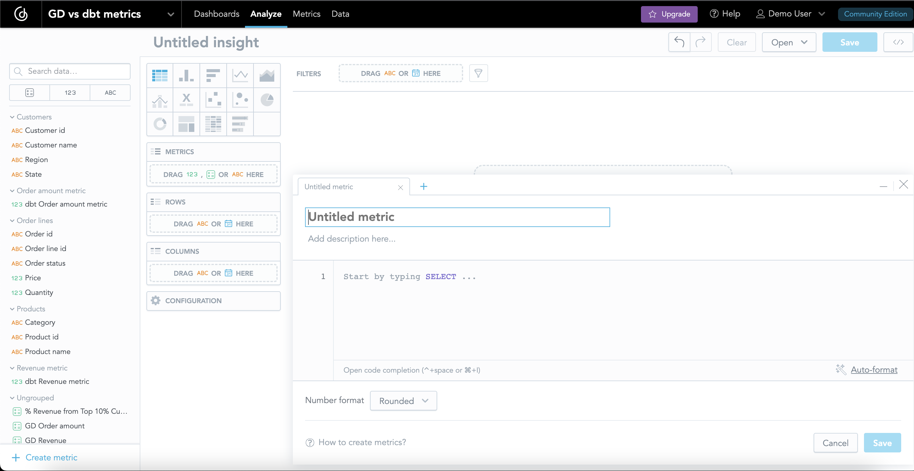
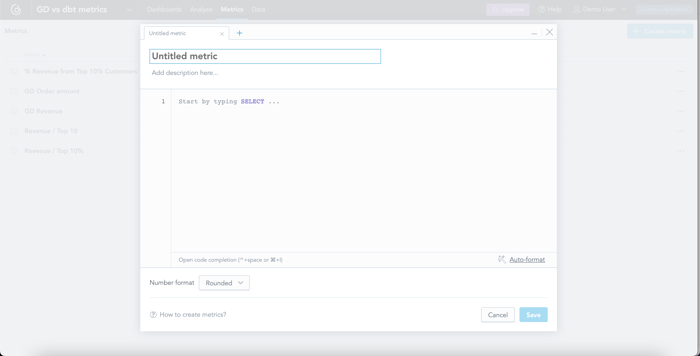

# This repository compares GoodData and dbt metrics

Important links:
* [GoodData metrics documentation](https://www.gooddata.com/developers/cloud-native/doc/cloud/create-metrics/concepts/metrics/)
* [dbt metrics documentation](https://docs.getdbt.com/docs/build/metrics)

## How to use this repo
There is a docker-compose.yaml file where are two defined services. One service starts GoodData and the second is bootstrapping of GoodData and dbt metrics. Run the following command in the root directory of this repo to start up services.

```bash
docker compose up -d
```

## Exploring

Feel free to explore and compare GoodData and dbt metrics. You can access running GoodData on [http://localhost:3000](http://localhost:3000). There is a bootstraped workspace with basic visualizatons and GoodData and dbt metrics.

GoodData credentials:
* Username: demo@example.com
* Password: demo123
* Token: YWRtaW46Ym9vdHN0cmFwOmFkbWluMTIz

Database credentials:
* Username: demouser
* Password: demopass

## GoodData metrics

You can create new metrics in GoodData in metric or in analyze tab. The metrics are created using [MAQL syntax](https://www.gooddata.com/developers/cloud-native/doc/cloud/create-metrics/maql/) which similar to SQL syntax.




If you want to store the progress you did in GoodData you can use the prepared script in [utils.py](utils.py). All data are stored in [bootstrap/gooddata](bootstrap/gooddata/) directory.
```bash
# first install requirement
python -m pip install gooddata-sdk==1.1.0

# run utils.py in interactive mode
python -i utils.py

# store your progress using store function
>>> store()

# load stored layout to GoodData using load function
>>> load()
```

## dbt metrics

You can change dbt metrics in [dbt model schema file](bootstrap/data_transformation/models/order_lines/schema.yml). When you update metrics all you need to do is to run the following commands in [data_transformation](bootstrap/data_transformation/) folder:

```bash
# install dependencies
dbt deps 

# run transformation
dbt run
```

> **Warning**
> Do not forget to have `~/.dbt/profiles.yml` file set. You can reuse [profiles.yml](bootstrap/profiles.yml) and do not forget to set the host to `localhost`.
